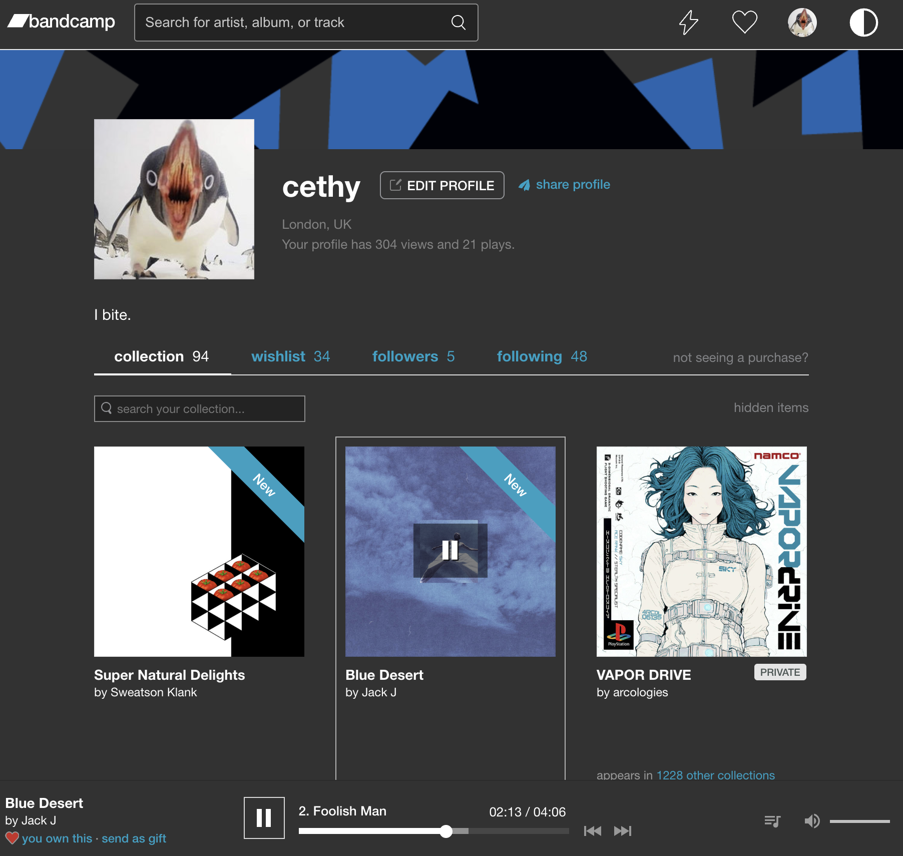

# Bandcamp.com Dark Mode (UserScript)

Add switchable dark mode styling + auto-toggle if computer setup for preferred dark color scheme, but only on bandcamp profile pages !

|  |  |
|:--------------------------:|:------------------------:|
| Light | Dark |

# How to use

- Install [Violentmonkey](https://violentmonkey.github.io/), greasemonkey, tampermonkey or any other userscript manager of your choice
- Copy the `bandcamp.com_profile_DarkMode.js` script content
- Enable it on bandcamp.com
- Enjoy!